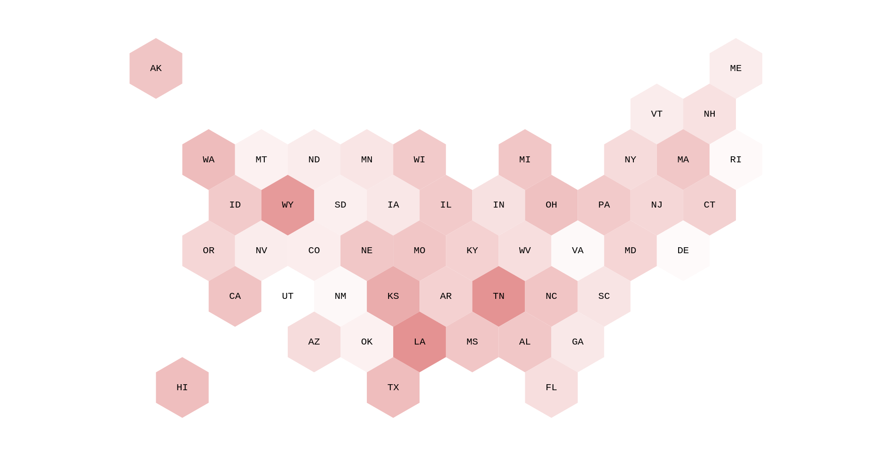
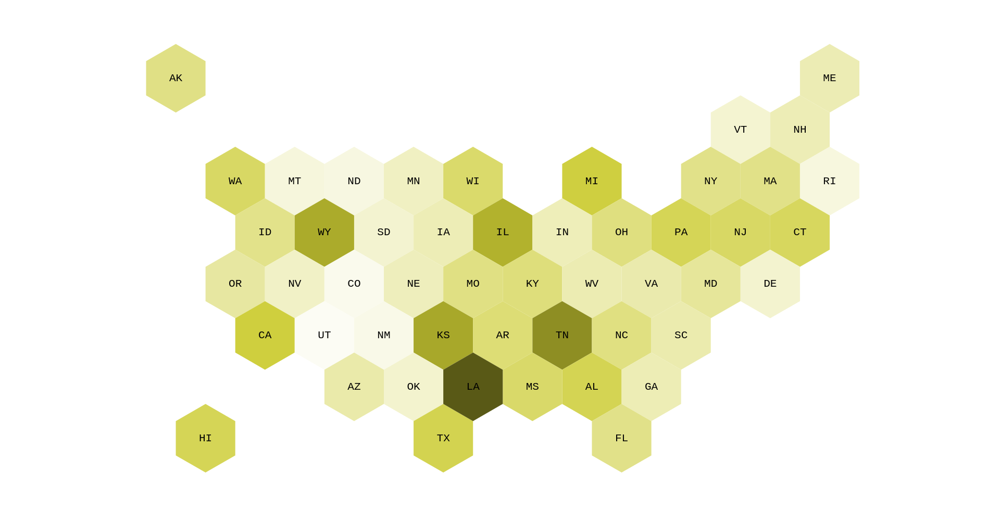
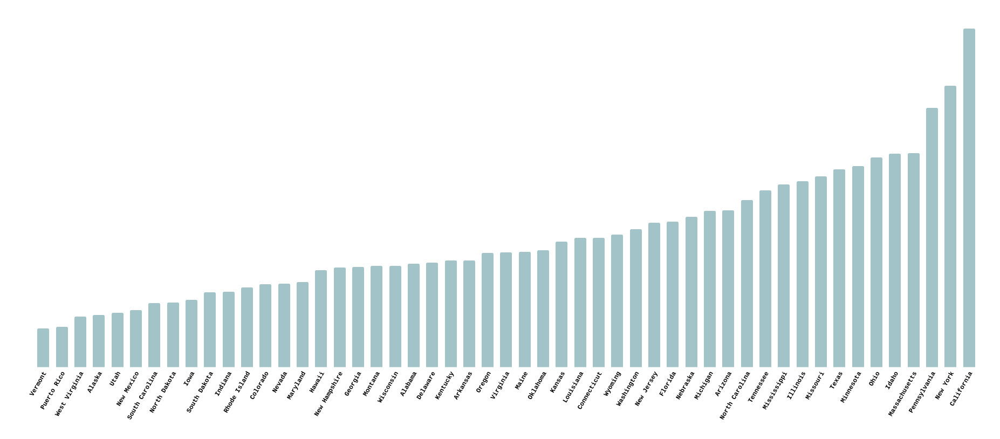

---

Assignment Name: Algorithms F23 Final Project  
Group Members: Wil Secord, Chloe Halverson, Will Titus, Theo King
Repository: https://github.com/wilSecord/cs160-final  

---
# U.S. States' Degree of Influence on Musical Artists

This project is an analysis of the degree of connection from _each U.S. state_ to the musical industry as a whole.

## Installing & Running

To run this project, you must have a [Postgres MusicBrainz database](https://musicbrainz.org/doc/MusicBrainz_Database/Download) replica. All results in this repository were made from a September 2023 database dump. 

You should also have a recent version of **Python** with `networkx`. A recent version of **Rust** is required for hosting interactive visualizations.

### Connecting to your Postgres database.

Scripts in this repo which require a Postgres connection expect a file `data.txt` in the repository root. The `data.txt` file should follow this format:

```
<username>
<host>
<port number>
<dbse>
<pass>
```

Newlines should be in the Unix format.

### Downloading Data Subset 

To download the subset of data which this project uses from your Postgres database, run `re-get-data.sh`.

Note that by default, this will break all data files into chunks that are under `40M`, such that they will be uploadable to GitHub. To adjust this threshold, use `MAX_FILESIZE_BYTES=<threshold> ./re-get-data.sh`

```console
user@computer /path/to/repo/cs160-final $ ./re-get-data.sh 
```

### Running Analysis 

Our analysis runs using the [NetworkX](https://networkx.org) Python library. It only considers links through the network of American artists for whom we know state associations. For example, a Californian artist connected to a Floridian through a Canadian wouldn't be considered.

We chose to do this because aggregating data for all artists takes a prohibitively lengthy amount of time, so focusing on our specific research question means that our analysis is able to finish in a timely fashion.

To run aggregated analysis, run the `graph.py` file in the repository root. This will print a CSV of analysis on a per-state basis.

```console
user@computer /path/to/repo/cs160-final $ python3 graph.py
```

For static image visualizations of this aggregated analysis, please see the [Results](#Results) section below.

### Running Visualization

Our interactive visualization runs using the [Petgraph](https://github.com/petgraph/petgraph) Rust library. It incorporates *all* artists: this is because artists can be selected arbitrarily at runtime, rather than showing aggregated answers. Although this may seem less applicable to our specific research question, user research shows that, in an interactive format, users prefer this. We have elected to instead have the visualization display a warning when a non-American artist is selected.

To create the visualization's cached [shortest-path trees](#connection-metrics), run the `min_tree_from_each_state` program in the `explorations` Rust project:

```console 
user@computer /path/to/repo/cs160-final/explorations $ cargo run --bin=min_tree_from_each_state
```

After this completes, the `visualizer/api_server` Rust project can be run to serve the visualization 

```console 
user@computer /path/to/repo/cs160-final/visualizer/api_server $ cargo run
```

## Objectives & Non-Objectives

This project is an attempt to:

- Analyze the musical industry as a whole
- Associate musical artists with U.S. states
- Visualize connection to states in the industry, such that
	- Users can understand where an **artist** is inspired by (other than their own home state)
	- Users can understand which **states** inspire the most artists.

This project does **not** attempt to:

- Analyze **musical style**, **genre**, **listening cohorts**, **amount of work**, or any other aspect of musical creation
- Analyze over **time**, **album series number**, **degree of collaboration**, or any other axis.
- Analyze geography outside of the United States

## Rationale of Algorithms, Lanugages, and Tools Used

This project utilizes breadth-first search in order to determine the degree of separation of a musician/band to a specific state. This degree allows us to analyze and understand the connections between artists and how other artists influence each other. Breadth-first search is a widely used algorithm to determine the shortest path between two nodes in a graph. BFS, as opposed to alternate shortest path algorithms, utilizes a simple implementation.

We used BFS for our shortest-path algorithm because, at this stage of the project, we are **not** attempting to weight edges. With unweighted edges, the well-known Dijkstra's algorithm is equivalent to a simple breadth-first search, but with a greater $\Theta(n)$ for its primitives' operations (i.e. a simple queue is more efficient than a priority queue).

The project uses two different languages for different purposes: Rust and Python. We started with writing our visualization code in Python, but quickly ran into issues with the amount of time that it took to run. We tried to optimize this performance, but struggled: we are unsure of the reason behind this, but *hesitantly* attribute it to Python's emphasis on readability over performance. As such, we chose to keep our more focused dataset in Python, but wrote Rust analysis for our visualizations. Because our Rust code analyzed a bigger dataset, we ended up having to write more scaffolding code for pre-processing 'explorations'. The more we could cut down the dataset, the better. As such, our Rust code has a greater size than our Python code. A future improvement to the project would be to attempt a pure Python codebase.

For our graph representations, we used the respective language ecosystems' foremost graph libraries. We used some algorithms from these for preliminary analysis (e.g. connected component analysis), but ensured understanding of the algorithms by re-implementation. A Python improvement could be to use a lower-level language implementation with Python bindings: since NetworkX is written in pure Python, not C/C++ (as many other high-performance Python libraries are), it is more vulnerable to this issue.

### Connection Metrics

In static aggregate analysis, all analysis is ran **per-state**: we are analyzing states. The following descriptions may be difficult to follow unless this is kept in mind.

When performing analysis, a tree is created; the root of this tree is the state itself, and each other node is an artist. Artists with degree `1` from the root (i.e. artists who are from the state) are excluded from the aggregate. This exclusion is to offset the effects of a large amount of artists hailing from a state: obviously, there *will* be network effects, but we do not want to assume that this is a low-impact effect.

Analysis is performed on the **degree** (of connection, from the tree's root) of each artist, aggregated over the state. We analyze the average and maximum for each state, as well as two weighted averages: linearly weighted and quadratically 

## Results

Below are charts of our aggregated static analysis:



This chart shows each state's **average** degree of connection to an artist (lower degree is darker). From this, we can see that although states like California and New York have more artists; Wyoming, Louisiana, and Tennessee have a closer average degree of connection.



This graph shows each state's **maximum** degree of connection to artists (lower degree is darker). Comparing the two, one can see that while Louisiana maintains its position as an outlier, Wyoming and Tennessee have less of a margin: Kansas and Illinois join this second cohort. 



This bar chart shows our linear weighted average aggregate (higher bar is further aggregate degree). We can see that New York, California, Pennsylvania, and Massachusetts are in the highest five -- these states also have many musical artists *native to those states*. Because this metric gives more preference to an immediate fan-out than a wide fan-out (i.e. a large number of artists with a low degree holds more influence than a large amount of artists with a high degree), this makes sense: a large artist population gives a large network, but one that is shallow. States with smaller amounts of artists sit (on average) at the low end of this range -- a closer aggregate degree. 

The outliers from previous graphs -- Louisiana, Wyoming, and Tennessee -- sit near the middle of this graph's range. We conjecture that this is likely because they all are traditional homes to older styles: (blues, bluegrass, and country, respectively), so their older artists, who have had more time to gather influence, have collaborated widely and therefore skewed the metric. More research on this matter would be helped by an incorporating analysis of musical styles.


## Project Retrospective

In our [midterm report](https://github.com/wilSecord/cs160-final/tree/midterm-report) and [inital report](https://github.com/wilSecord/cs160-final/tree/78f0d9aad897440c5330bc14cc4e8165f69dc3ca), we set and reinforced the objectives of:

- Full analysis results
- Finished visual presentation

We accomplished these goals, but they definitely could have been accomplished in a better way. While all goals were complete technically, the project could have benefited from more exploration and analytics.

It would have helped our completion to be more smooth if, rather than our unstructured, informal project management strategy, we had elected a 'group leader' at the start. A formal leader, manager, or lead would have had the explicit responsibility to manage and keep track of timeline and prevent us from falling into scope creep; this would have been extremely helpful for our organization while maintaining a democratic structure, as the manager doesn't have more 'power' in actuality: just the official responsibility which connotates the ability to set schedules and such.